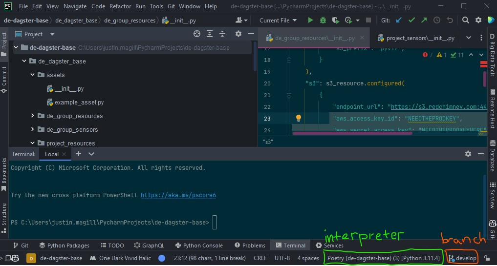
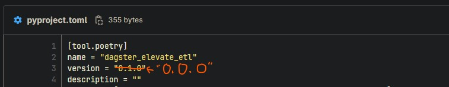

# de-dagster-base
![Python plus Dagster][pydag]
## BASE TEMPLATE FOR DATA ENGINEERING DAGSTER PROJECTS 

## USAGE

## Creating a New Project
- Login to [GitLab](https://gitlab.redchimney.com) and head to your team (group) page under the Data Engineering group
- Click the 'New Project' button
- Create from Template
- Select this project as your template
- Clone the project to your machine
- Use your IDEs 'refactor' tooling to rename the project to a name that fits and follows [departmental standards]().
- You're ready to get started!

## Getting to Work
- Please follow the best practices regarding branch / workflow management with Git. This will make life easier for all.
- The CI/CD pipeline requires a couple of team-specific items be set.  See section below for details.

TODOs After Creating Your Project
- [ ] Rename things (see note below)
- [ ] Go through .env file and add / correct variable values which will be required.  Keep this updated as you code. 
These same variables / values also need to make it to your deployments
- [ ] Create a 'feature' branch from the develop branch (template comes with 'main' and 'develop', both are protected)
- [ ] Create a virtual environment with Poetry, configure it and add dependencies (see [Poetry](#poetry-) section below)
- [ ] Add Dagster metadata to pyproject.toml (see [Dagster & pyproject.toml](#dagster--pyprojecttoml) section below)
- [ ] Create some assets!  Assets defined in the proper folder should be picked up by the existing code in the 
project (the \_\_init\_\_.py nearest project root level handles that part)
- [ ] When you're ready for local testing, use Poetry to start Dagster and supply dependencies properly (info in the 
[Poetry section](#poetry-))  
- [ ] If you're looking to trigger your asset materialization based on another asset's materialization which 
isn't part of the pipeline you're building here, there's a sensor for that!  Check out the de-group-sensors package.
- [ ] Commit early and often to the repository, and always pull before you push or create a merge request! 
It's much better to resolve conflicts locally rather than in the web GUI or anywhere remote for that matter
- [ ] Set CI/CD configuration items to appropriate values for your team (see [CI/CD](#configuring-cicd) section)
- [ ] Use Black to format your code (see [Black formatting](#format-your-code-with-black)).  
- [ ] Check out the [Git workflow diagram in Miro][git_workflow].  It'll inform you how to make the CI/CD work and how you should go about ultimately getting your code to prod! 

*NOTE*: 
You'll need to rename package folders within the new project to match your new project name.  
🔥 **The best option is to use the included update_toml_plus_packages script** (see [Auto Update Script](#auto-update-script)).

Manually, this is easy enough, just use the refactor functionality in PyCharm (or your IDE of choice) rather than 
standard Windows/Linux methods (Windows slow double click, etc.)
  - Please name the package containing your assets the same thing as your project name.  This is important for the CI/CD pipeline to work properly.  This will simplify your life.  
    - Do the same with the package_name_tests folder, e.g. de_dagster_base_test => {insert_project_name}_test

## Configuring the Project Locally
- You'll need a virtual environment and a tool to manage dependencies. It's relatively straightforward to use either Poetry or pip + venv. Poetry is recommended and our documentation will tend to use it over pip + venv

### Poetry 
- Install Poetry if it isn't present on your machine.  [Poetry Installation](https://python-poetry.org/docs/#installation)
- If you're using a Bash shell, it's recommended that you enable Poetry tab completion as follows:
```bash
poetry completions bash >> ~/.bash_completion
```
- *UPDATE* Attempting to use a prebuilt pyproject.toml for the template. If you're going to use the 
preexisting pyproject.toml, you can skip to the 'poetry shell' command below.
  - *YOU MUST UPDATE [NOTED ITEM](#dagster--pyprojecttoml) TO REFLECT THE PROPER PACKAGE NAME*
- Poetry and Dagster utilize pyproject.toml, and the provided file is a good starting point.  
- First initiate a Poetry shell session. This will create and activate a virtual environment. When we set our Python interpreter, it'll be important that the shell is active. 
```bash
poetry shell
```
- Run poetry lock (and run it any time Poetry is having difficulty resolving dependencies, then retry whatever you were attempting)
```bash
poetry lock
```
- To confirm everything worked as expected, command below shows you the current configuration and locations of your virtual environment.  Note the location for the next step
```bash
poetry show -v
```
- You'll need to instruct your IDE to use this new virtual environment to make things like adding dependencies via GUI work smoothly.  
    - In PyCharm, at the very bottom right of the UI, there is a Python interpreter indicator
      
    - Click on it and select 'add new interpreter' > 'add local interpreter'
    - Select Poetry environment from the left column, and select 'Existing environment'  
      - With any luck, PyCharm autofill the path for you because you've started a Poetry shell in the IDE terminal. 
      - If not, fill in the path displayed by the 'show' command. 
- Running Dagster locally to test your work is easy enough.
  - Within your projects root folder:
  - Run poetry lock if you haven't just done it, then ensure dependencies are installed
  ```bash
  poetry install
  ```
  - Use 'poetry run' to launch Dagster / Dagster Webserver
  ```bash
  poetry run dagster dev -p 3001
  ```
    - We're specifying port because port 3000 (Dagster Webserver's default) is often already in use.  You can try without the -p flag if you'd like.  If 3001 throws and error, pick something else.  You can examine ports your machine is using, but trying a couple will probably handle it in an expeditious manner.
***
#### Set 'version' in  pyproject.toml to "0.0.0"
- Poetry will create the pyproject.toml file with a version of 0.1.0 by default. We need to change this to 0.0.0 and keep it there. The template is configured with this version placeholder, just be aware that it doesn't need to reflect the actual version.  The CI/CD pipeline takes care of that for us.  
  - There's nothing special about "0.0.0", it's just the placeholder which the CI/CD pipeline looks for when using dynamic versioning.
  - The template now defaults to "0.0.0".  Just leave it as is, and the CI/CD pipeline will take care of the rest.
  
***
#### Troubleshooting Failures to Resolve Dependencies
- Sometimes you'll get a spanner in the works and Poetry gets stuck / repeatedly fails attempts to add a dependency.  The more dependencies you add the more complex the process for ensuring they all can coexist peacefully.  
- A few steps you can take:
    - If you're attempting from PyCharm GUI, try and add the dependency via the shell you've started 
    - Run *poetry lock*, then attempt to add the dependency again (this fixes things very frequently)
    - Still having trouble? Delete Poetry's caches (you may have different cache names, but these are likely the caches you'll find).  Run 'poetry lock' again and try to add the dependency.
    ```bash
    poetry cache list --all
    ```
    Then delete the contents of the caches returned from above command (typically you'll see these two caches).
    ```bash
    poetry cache clear _default_cache --all
    ```
    ```bash
    poetry cache clear PyPI --all
    ```
***
### Dagster & pyproject.toml
- You'll find a Dagster entry in the supplied pyproject.toml file.  The module name should be updated to match the name of the package containing your Dagster assets.
```
[tool.dagster]
module_name = "my_dagster_module"
```
- These two things must match. You'll be renaming the 'de_dagsterbase_template' (pardon the old name in the images below) package, so make sure the pyproject.toml setting matches your project structure.

![pyproject.toml include package][pyproject_toml_pkgs]   ![top level package must match][toml_must_match_this]

### Auto Update Script
- *PRO-TIP*: Use the included update_toml_plus_packages script to automatically update your pyproject.toml and eliminate the possibility of a mismatch. The script is in the cicd_scripts folder, but you should just run it from your IDE by hitting the run arrow below! If you want to execute it from the terminal, same advice.  Just go to project root and run python ./cicd_scripts/update_toml_and_packages.py
```bash
# RUN THIS FROM YOUR PROJECTS ROOT DIRECTORY.  IF YOU'RE USING PYCHARM, MAKE SURE THE TERMINAL IS AT THE PROJECT ROOT
python ./cicd_scripts/update_toml_and_packages.py
```
***
### Format your code with black
- Avoid the CI/CD pipeline complaining about code format. Avoid your templates getting irked about your peculiar formatting choices. Use [black](https://github.com/psf/black) to format your code locally prior to pushing to remote.  
- To install (run this outside of a virtual environment, so you don't have to reinstall black every time you create a new environment, it doesn't need to actually become part of any particular solution, so leave it global): 
```bash
pip install black
```
- To format your code (execute in top level project folder):
```bash
black .
```
***
### Utilizing Group and Project Resources
Within the de_dagsterbase_template package you'll find resources and sensors divided into 'group' and 'project' sets
The 'group' sets will be preconfigured for all projects across Data Engineering.
- These resources should all be configured to infer the appropriate environment from the DAGSTER_DEPLOYMENT variable.
  - The DAGSTER_DEPLOYMENT variable is read in the top level __init__.py file.
  - Dictionaries for group and project resources are merged (using Python dictionary merge operator, see implementation below), with group resources taking precedence.
  ```python
  resources_by_deployment_name = {
    "prod": group_resources.GROUP_RESOURCES_PROD | project_resources.PROJECT_RESOURCES_PROD,
    "uat": group_resources.GROUP_RESOURCES_UAT | project_resources.PROJECT_RESOURCES_UAT,
    "dev": group_resources.GROUP_RESOURCES_DEV | project_resources.PROJECT_RESOURCES_DEV,
    "local": group_resources.GROUP_RESOURCES_LOCAL | project_resources.PROJECT_RESOURCES_LOCAL,
  }
  ```
- See resources in de_group_resources for examples of how to configure resources per environment. One example, configuring the s3_pickle_io_manager:
  ```python
  from dagster_aws.s3 import s3_pickle_io_manager
    
    
  GROUP_RESOURCES_PROD = {
    "io_manager": s3_pickle_io_manager.configured(
        {
            "s3_bucket": "s3-d07dagster01-dagster-k8s-test-02",
            "s3_prefix": "pyviz",
        }
    ),
  }
  GROUP_RESOURCES_UAT = {
    "io_manager": s3_pickle_io_manager.configured(
        {
            "s3_bucket": "s3-u07dagster01-dagster-k8s-test-02",
            "s3_prefix": "pyviz",
        }
    ),
  }
  GROUP_RESOURCES_DEV = {
    "io_manager": s3_pickle_io_manager.configured(
        {
            "s3_bucket": "s3-d07dagster01-dagster-k8s-test-02",
            "s3_prefix": "pyviz",
        }
    ),
  }
  GROUP_RESOURCES_LOCAL = {
    "io_manager": s3_pickle_io_manager.configured(
        {
            "s3_bucket": "s3-d07dagster01-dagster-k8s-test-02",
            "s3_prefix": "pyviz",
        }
    ),
  }
  ```
- Sensors can be configured in a similar manner.  See de_group_sensors for examples.
- **IMPORTANT**: Building a useful set of group resources and sensors is going to depend on a long-running group effort.  If you've built a project resource or sensor that seems useful to Data Engineering, please contact a Data Solution Architect or just submit a merge request to the develop branch of this project.  *Thank you!!*  
### Configuring CI/CD
- The included CI/CD pipeline is based on a template housed in the TeamDagster group. 
- Most everything is generic enough to just work, but there are a couple of things that need to be set to 
send your package to the correct team package registry and to kick off the correct container builds. 
- Information regarding configuring your project's CI/CD pipeline based on the template can be found here:
[TeamDagster CI/CD README][cicd_readme]
- That project's README contains information about configuring your gitlab-ci.yml. 
It should not require any changes which aren't specifically noted.
- Lastly, this image shows some important aspects of the relationship between the CI/CD pipeline in your 
- project and the template that is being included in it.  You'll need to use the noted variable to point at the package-registry within your team's subgroup (for example, ID location for TeamDagster subgroup noted in second image below).
![GitLab CI/CD Relationship][cicd_inheritance]
![GitLab package registry ID][gl_pkg_registry]

## Jira / Pivotal Tracking
Both Jira and Pivotal are enabled.  Either one can be used to tie your commits to work on specific cards.
- **Jira** looks for the issue ID somewhere in the commit message (e.g. DAGGIT-1)
  - Ideally, follow the branch naming convention (*e.g. bugfix/DAGGIT-2/fix-something-kebab-case*) so the entire branch 
  is tied to the card. That makes code reviews a breeze.
- **Pivotal** looks for the card ID surrounded in square brackets and prepended with a \# (e.g. [\#12345])

## Create your own README!
This README has served its purpose, so it's time to create your own.  
- You can do this by simply renaming this file to README.old.md or something similar.  
- Now create a new README.md file and fill it with your own content.  
- You can use this README as a template if you like, but it's probably best to start fresh.  
- You can always refer back to this README if needed.
- The project contains a very generic starter README (README-default.md), feel free to use it or delete it.

## Resources
- [Dagster Docs](https://docs.dagster.io/)
- [GitLab CI/CD Predefined Variables](https://docs.gitlab.com/ee/ci/variables/predefined_variables.html)
- [gitlab-ci.yml](https://docs.gitlab.com/ee/ci/yaml/gitlab_ci_yaml.html)
- [Poetry CLI Commands](https://python-poetry.org/docs/cli/)

***
## Contributing
This project requires merge request approval by a Data Solution Architect. 
That said, if you have changes you think ought to be made or beneficial additions, 
please go ahead and create the merge request!  Without your help we won't get to where we need to be.


[pydag]: img/PyDag.png
[pyproject_toml_pkgs]: img/pyproject_toml_packages.jpg
[toml_must_match_this]: img/pyproject_toml_packages_match_this_package.jpg
[gl_pkg_registry]: img/gitlab_package_registry_id.jpg
[cicd_inheritance]: img/gitlab_cicd_yml_parent_child_relationship_edit.jpg
[cicd_readme]: https://gitlab.redchimney.com/dataengineering/teamdagster/cicd-pipelines/-/blob/master/README.md
[git_workflow]: https://miro.com/app/board/uXjVM1YmAWA=/?share_link_id=356580319781
